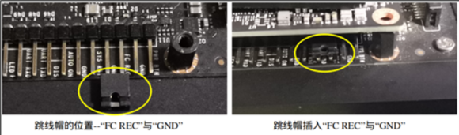
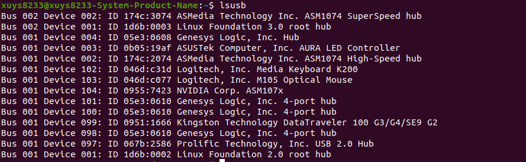
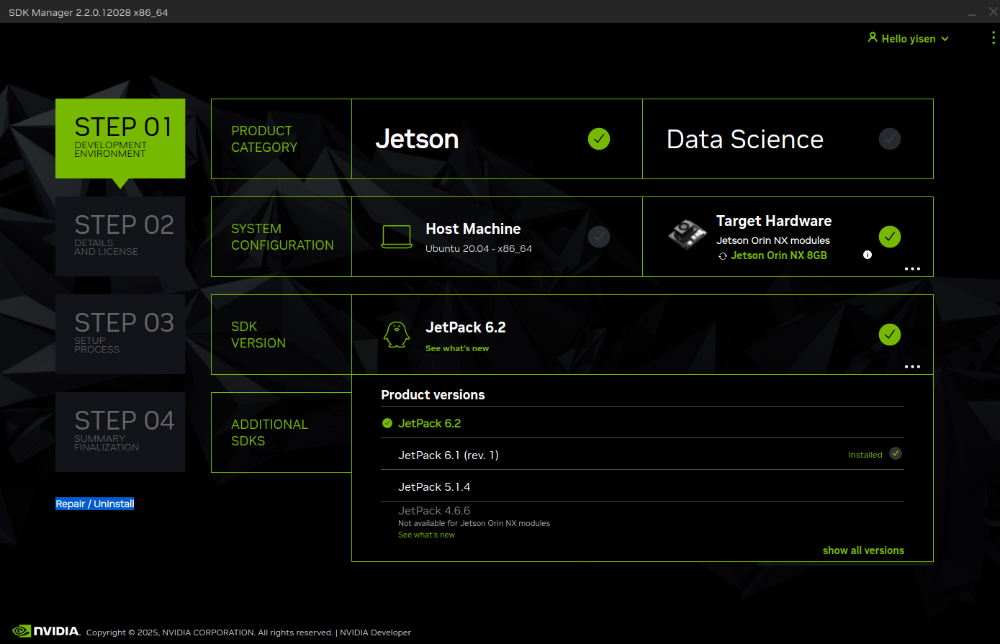
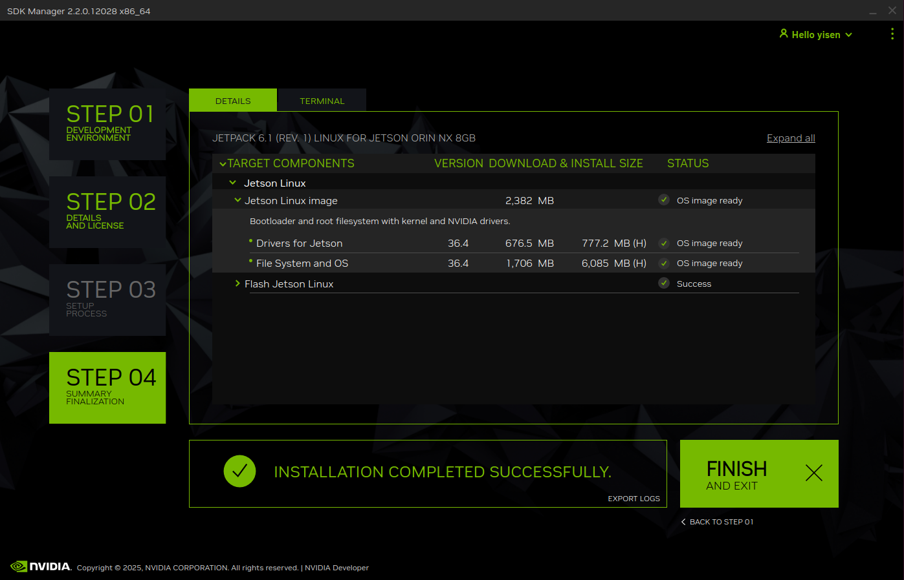

## 概述

    本章主要帮助开发者快速上手使用 JESTON 开发套件。

## 硬件安装步骤（模组、载板、配件连接）

    

## 系统烧录

### 1. 主机环境配置

- 编程环境：ubuntu20.04（需要预留100GB以上的空间去下载镜像资源）

- 下载 [SDK Manager](https://developer.nvidia.com/sdk-manager) deb包，将deb拷贝到用户的目录下

- 启动终端后，运行下面的指令去安装SDK Manager
  
  ```shell
  sudo dpkg -i sdkmanager_2.2.0-12021_amd64.deb  # deb版本替换为您下载的版本
  ```

### 2. 硬件配置（进入recovery模式）

- 如下图所示，使用跳帽短接FC REC和GND ，然后给AIBox开发板上电
  
  

- 将 Micro USB 线从 JESTON 的 Micro USB 端口连接到 Linux 主机 PC 的 USB TypeA 端口。

- 然后通过指令`lsusb`检查设备是否处于recovery模式，你会看到带有 ID 0955:623 的 NVidia Corp 设备。**（注：如果出现NVidia Corp 设备，说明未正确进入recovery模式，请检查跳帽和usb线缆。）**
  
  

- 确认进入recovery模式后，拔掉短接的跳帽。

### 3. SDK Manager烧录步骤

- 完成SDK Manager的安装后，启动终端运行sdkmanager , 点击 “LOGIN”，登录到您的 NVIDIA 帐户，浏览器弹出链接，并输入您的注册电子邮件和密码登录。
  
  

- 成功登入后，进入“STEP 01”参考按照下述配置选择
  
  - 从“**Product Category**”面板中，选择Jetson
  
  - 从“**System Configuration**”面板中，选择当前连接的设备型号。（默认USB线缆连接后，进入recovery mode时，默认会自动显示当前的硬件设备，如未显示，请点击刷新）
    
    
  
  - 从“**SDK VERSION**”面板中，选择所需JetPack SDK版本，点击右下角 (...)可以查看更多版本选择。
    
    
  
  - 完成选择后，点击“**Continue**”进入下一步

- Step2， 选择所需组件和接受许可证
  
  - 在该步骤可以查看到将要安装的组件。（如第一次验证，可以取消选择Jetson相关的组件，仅保留Jetson的镜像即可）
  
  - 检查屏幕底部的下载和安装选项路径，接着检查组件并接受许可证。
    
    
  
  - 选择“**Continue**”继续下一步

- Step3，安装
  
  - 点击“INSTALL”后，SDK Manager 会提示您输入 root 密码
    
    
  
  - SDK Manager软件会显示下载和安装的进度
    
    
  
  - 当下载完烧录镜像后，会跳出来以下页面，可以填入JESTON预设账户密码，以及选择“**NVMe**”
    
    

- Step 04， 完成烧录
  
  - 烧录完成如下图，点击 ”**FINISH**“ 完成烧录，重启JESTON即使用。
  
  

## 启动测试

    如果您是第一次使用JETSON系统，可以参考 **链接** 进行首次系统配置

### 1. 风扇

- 安装jtop
  
  ```shell
  sudo apt install python3-pip
  sudo pip3 install jetson-stats
  sudo reboot
  ```

- 重启后，启动终端运行`sudo jtop`，鼠标点击下方”6CTRL“, 在”Profiles“中选择”manual“配置，然后可以通过Speed的 [-][+]去控制风扇的转速。
  
  

### 2. 摄像头

```shell
nvgstcapture-1.0
```

### 3. AI模型

- image test

- video test

## NVIDIA Official Resource

[Jetson Linux Developer Guide - Quick Start](https://docs.nvidia.com/jetson/archives/r34.1/DeveloperGuide/text/IN/QuickStart.html)

[Jetson Download Center](https://developer.nvidia.com/embedded/downloads)

[Download NVIDIA SDK Manager](https://developer.nvidia.com/sdk-manager)
