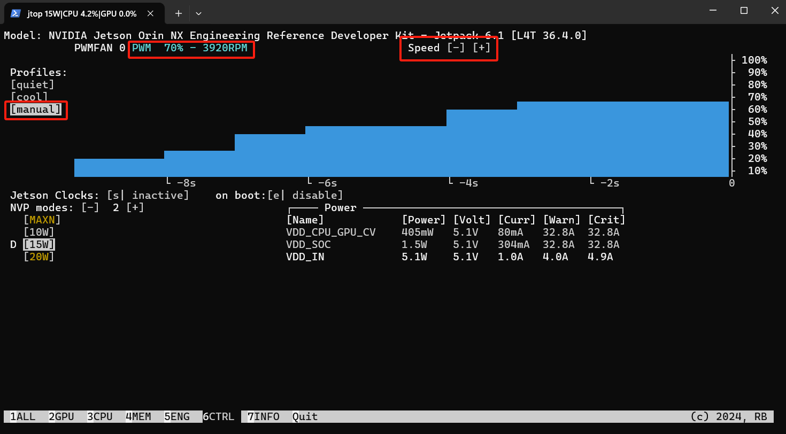

## 概述

    本章主要帮助开发者快速上手使用 JESTON 开发套件。

## 硬件安装步骤（模组、载板、配件连接）

- 套件包含的所有物品

- 硬件设置：连接电源、安装散热器或风扇、连接外设（鼠标、键盘、显示器、网络）

    

## 系统首次配置

    本小节主要说明首次启动设备的基本的网路环境配置和ssh远程登入方法。如购买的是无预装镜像的设备，请参考 **链接**(System Flashing) 进行系统烧录。

### 1. 用户设置

- 创建新用户
  
  - 首次启动系统时，通常会提示创建一个新用户。如未创建用户活添加新用户，可以参考如下步骤
  
  - 启动终端
  
  - 输入以下命令创建新用户（将`username`替换为你的用户名）：
  
  ```
  sudo adduser username
  ```
  
  - 按照提示设置密码并填写用户信息
  
  - 切换到新创建的用户，可以使用以下命令
  
  ```shell
  su - username
  ```

- 设置语言
  
  - 启动终端
  
  - 运行以下命令配置时区
  
  ```shell
  sudo dpkg-reconfigure locales
  ```
  
  - 选择所需的语言（如`en_US.UTF-8`），然后设置为系统默认语言。

- 设置时区
  
  - 启动终端
  
  - 运行以下命令配置时区
  
  ```shell
  sudo dpkg-reconfigure tzdata
  ```
  
  - 根据界面提示,选择地区和城市以设置时区（如：Asia）

- 确认当前Jeston软件版本
  
  - 启动终端，运行以下命令确认软件版本
    
    ```shell
    $ sudo jetson_release
    Software part of jetson-stats 4.3.1 - (c) 2024, Raffaello Bonghi
    Model: NVIDIA Jetson Orin NX Engineering Reference Developer Kit - Jetpack 6.1 [L4T 36.4.0]
    NV Power Mode[2]: 15W
    Serial Number: [XXX Show with: jetson_release -s XXX]
    Hardware:
    - P-Number: p3767-0001
    - Module: NVIDIA Jetson Orin NX (8GB ram)
    Platform:
    - Distribution: Ubuntu 22.04 Jammy Jellyfish
    - Release: 5.15.148-tegra
    jtop:
    - Version: 4.3.1
    - Service: Active
    Libraries:
    - CUDA: 12.6.68
    - cuDNN: 9.3.0.75
    - TensorRT: 10.3.0.30
    - VPI: 3.2.4
    - Vulkan: 1.3.204
    - OpenCV: 4.8.0 - with CUDA: NO
    ```

### 2. 有线网络配置

#### 2.1 CMD配置静态网络ip

- 启动终端，执行以下命令确认当前的网络接口设备
  
  ```shell
  ip link show
  ```
  
  该命令会列出所有网络接口设备及其状态。你会看到类似以下的输出：
  
  ```shell
  1: lo: <LOOPBACK,UP,LOWER_UP> mtu 65536 qdisc noqueue state UNKNOWN mode DEFAULT group default qlen 1000
      link/loopback 00:00:00:00:00:00 brd 00:00:00:00:00:00
  2: enP8p1s0: <BROADCAST,MULTICAST,UP,LOWER_UP> mtu 1500 qdisc fq_codel state UP mode DEFAULT group default qlen 1000
      link/ether 00:1e:67:8e:dc:3b brd ff:ff:ff:ff:ff:ff
  ```
  
  其中`enP8p1s0` 是我们需要配置的网络接口名称

- 配置静态 IP
  
  - 添加新的以太网连接：
  
  ```shell
  sudo nmcli con add type ethernet ifname enP8p1s0 con-name ethernet-static ip4 192.168.60.3/24 gw4 192.168.60.1
  ```
  
  - type ethernet：指定连接类型为以太网。
  
  - ifname enP8p1s0：指定网络接口名称。
  
  - con-name ethernet-static：为连接命名。
  
  - ip4 192.168.60.3/24：设置静态 IP 地址和子网掩码。
  
  - gw4 192.168.60.1：设置默认网关。
  
  - 配置 DNS 服务器
    
    ```shell
    sudo nmcli con mod ethernet-static ipv4.dns "8.8.8.8,8.8.4.4"
    ```
  
  - 启用新的网络连接：
    
    ```shell
    sudo nmcli con up ethernet-static
    ```

- 查看是否配置成功

```shell
nmcli con show
```

该命令会列出所有网络连接及其状态，确认 ethernet-static 连接已成功配置并处于激活状态。你会看到类似以下的输出：

```shell
    NAME                UUID                                  TYPE      DEVICE
ethernet-static     12345678-1234-1234-1234-1234567890ab  ethernet  enP8p1s0
```

#### 2.2 图形化界面配置

- 在桌面左上角，点击打开 `Wired Settings`

- 配置网络
  
  - 在弹出的网络设置窗口中，选择当前的有线网络连接。
  - 点击 `齿轮` 图标进入详细设置
    - 在 `IPv4` 标签页下，选择 `Manual`（手动）配置。
    - 输入静态 IP 地址、子网掩码和网关。例如：
      - **地址**：192.168.60.3
      - **子网掩码**：255.255.255.0
      - **网关**：192.168.60.1
    - 在 DNS 部分，输入 DNS 服务器地址，例如 `8.8.8.8` 和 `8.8.4.4`。
    - 点击 `Apply` 保存设置。

- 配置完成后，建议重启网络以应用新的设置。

#### 网络验证

- 打开终端，通过以下指令确认网络是否正常

```shell
ping google.com
```

    会看到如下输出，如果能够成功 ping 通 Google，则说明网络配置成功并且网络连接正常。

```
PING google.com (142.250.199.78) 56(84) bytes of data.

64 bytes from hkg07s37-in-f14.1e100.net (142.250.199.78): icmp_seq=1 ttl=113 time=29.4 ms
64 bytes from nchkgb-ai-in-f14.1e100.net (142.250.199.78): icmp_seq=2 ttl=113 time=29.2 ms
64 bytes from hkg07s37-in-f14.1e100.net (142.250.199.78): icmp_seq=3 ttl=113 time=28.9 ms
64 bytes from nchkgb-ai-in-f14.1e100.net (142.250.199.78): icmp_seq=4 ttl=113 time=29.4 ms
```

### 3. SSH访问和文件传输

#### 3.1 SSH远程登录

- 在windows下，可以通过在 “开始” 菜单中搜索 “PowerShell”，然后选择 “Windows PowerShell” 。

- 启动powershell之后，通过SSH指令远程登录
  
  ```shell
  ssh user@host #user替换成用户名、host替换成需要访问的目标主板IP
  ```
  
  应用实例：
  
  ```shell
  ssh root@192.168.60.3
  ```

#### 3.2 SCP文件传输

- 启动powershell，运行以下指令
  
  ```shell
  scp [可选参数] file_source file_target
  ```
  
  应用实例：
  
  ```shell
  # 本地拷贝到远程，将xx.mp3文件复制到远程music目录下，root@192.168.60.3远程主机的用户名及ip
  scp ./xx.mp3 root@192.168.60.3:/home/root/  
  # 远程拷贝到本地
  scp root@192.168.60.3:/home/root/others/music/1.mp3 /home/test/ 
  ```

## 启动测试

### 风扇

- 安装jtop
  
  ```shell
  #安装jtop
  sudo apt install python3-pip
  sudo pip3 install jetson-stats
  sudo reboot
  
  # 运行程序
  sudo jtop
  
  #查看风扇转速
  cat /sys/devices/platform/bus@0/39c0000.tachometer/hwmon/hwmon2/rpm
  ```

- 重启后，启动终端运行`sudo jtop`，鼠标点击下方”6CTRL“, 在”Profiles“中选择”manual“配置，然后可以通过Speed的 [-][+]去控制风扇的转速。
  
  

### 摄像头

```shell
# enable imx219 sensor
sudo python config-by-hardware.py -n 2='Camera IMX219 Camthink'

# reboot
sudo reboot

# sensor 0
nvgstcapture-1.0 --sensor-mode 0 --sensor-id=0
# sensor 1
nvgstcapture-1.0 --sensor-mode 0 --sensor-id=1
```

### 镜像版本

```shell
#check module
cat /proc/device-tree/model

#check OS release version
cat /etc/os-release

#check tegra version
cat /etc/nv_tegra_release

#确认模组SN
cat /sys/firmware/devicetree/base/serial-number
```

## NVIDIA Official Resource

**NVIDIA Jetson Software:**
[Jetson Linux Developer Guide - Quick Start](https://docs.nvidia.com/jetson/archives/r34.1/DeveloperGuide/text/IN/QuickStart.html)

[Jetson Jetpack SDK](https://developer.nvidia.com/embedded/jetpack)

[Jetson FAQ](https://developer.nvidia.com/embedded/faq)

[Jetson Download Center](https://developer.nvidia.com/embedded/downloads)

[Download NVIDIA SDK Manager](https://developer.nvidia.com/sdk-manager)

**Software Forum:**
[Jetson Developer Forum](https://forums.developer.nvidia.com/c/agx-autonomous-machines/jetson-embedded-systems)
