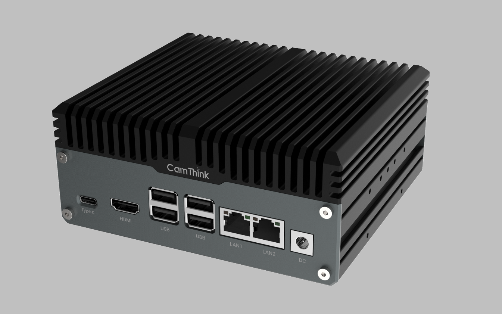

- **Jetson Module Specifications and Features**
  
          本产品支持的核心模组包括Orin Nano/NX, 及对应的Super版本。但不支持AGX Orin系列。Jetson Orin 系列模组因配置不同，性能存在差异。
  
  Note: Super版本只在Jatpack6.1+才支持
  
  
  
      模组的主要差异，如下几点：  

  - Cores数量差异，及主频差异带来的性能差别
  - CPU/GPU主频差异对性能的影响
  - DRAM大小及带宽性能对数据处理能力的影响
  - DLA/PVA功能模块有无及数量的影响
  - 供电要求（如Orin Nano只支持5V供电），及对应功耗和散热的差异

- **Custom Carrier Board Features and Interface Description**
  
     本产品的载板，基于原官方Carrier Board基础上进行拓展和优化。
  
    Main features：
  
  - 100M/1000M 双网口
  
  - TypeA*4 USB3.1+; Type-C *1  USB3.2
  
  - M.2 Key M  *2 for storage, Key B for Cellular, Key E for Wifi/BLE
  
  - HDMI*1
  
  - Audio Input/Output 
  
  - DI *4  DO *4 with isolation, RS232 *1, RS485 *1, 5V output
  
  - DC-Jack 12-36 V input; 
  
  - RTC Backup Battery 
  
  - Camera Input Interfaces *2 （MIPI）
  
  - 14Pins FFC可拓展IO接口
    
         

- **Accessories and Their Uses**
  
  - Camera modules
    
    兼容树莓派镜头模组，并提供 “Camera Module V2” 和 "HQ Camera"可选
    
    - Camera Module V2: IMX219 4K resolution with fixed Lens
    - HQ Camera:                   IMX477 12Mp resolution with CS-Mount Lens
  
  - Sensor modules
    
    - 可通过DI/DO，及RS485,RS232, GPIO来外接各种传感器
  
  - Expansion modules
    
    - 4G 模组
    
    - 5G 模组
    
    - WiFi/BT 模组
    
    - WiFi Halow模组
  
  - Mounts and enclosures
    
    整机无风扇设计，并提供灵活安装的支架配件
