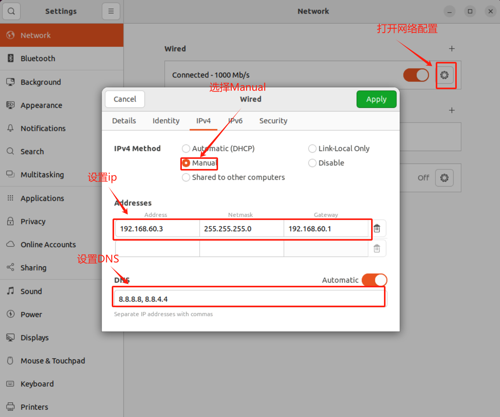
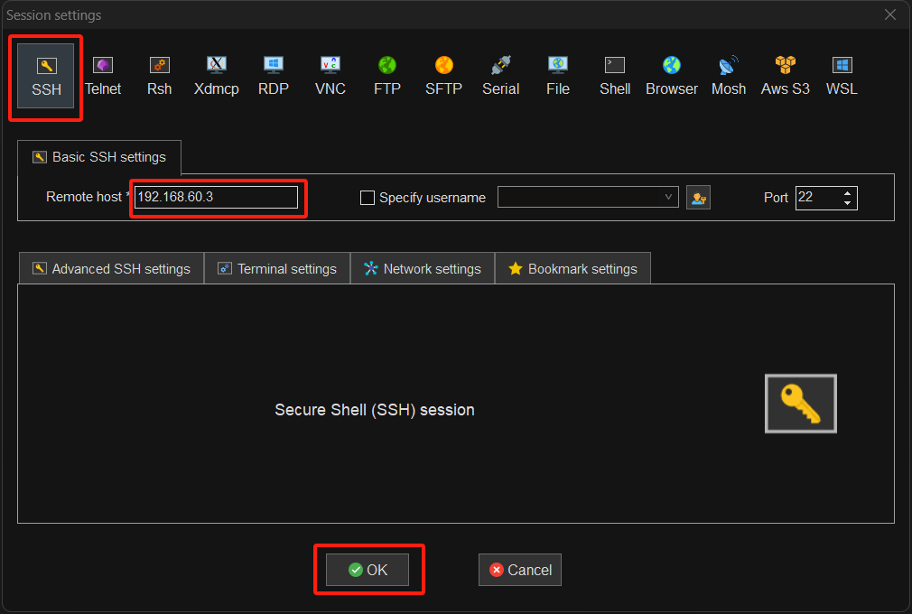

# System Initialization and Flashing

## 系统首次配置

    本小节主要说明基本的网路环境配置和ssh远程登入方法，如需进一步配置调试环境，请参考：

### 1. 用户设置

### 2. 网络配置

#### 2.1 CMD配置静态网络ip

- 启动终端，执行以下命令确认当前的网络接口设备
  
  ```shell
  ip link show
  ```
  
  该命令会列出所有网络接口设备及其状态。你会看到类似以下的输出：
  
  ```shell
  1: lo: <LOOPBACK,UP,LOWER_UP> mtu 65536 qdisc noqueue state UNKNOWN mode DEFAULT group default qlen 1000
      link/loopback 00:00:00:00:00:00 brd 00:00:00:00:00:00
  2: enP8p1s0: <BROADCAST,MULTICAST,UP,LOWER_UP> mtu 1500 qdisc fq_codel state UP mode DEFAULT group default qlen 1000
      link/ether 00:1e:67:8e:dc:3b brd ff:ff:ff:ff:ff:ff
  ```
  
  其中`enP8p1s0` 是我们需要配置的网络接口名称

- 配置静态 IP
  
  - 添加新的以太网连接：
  
  ```shell
  sudo nmcli con add type ethernet ifname enP8p1s0 con-name ethernet-static ip4 192.168.60.3/24 gw4 192.168.60.1
  ```
  
  - type ethernet：指定连接类型为以太网。
  
  - ifname enP8p1s0：指定网络接口名称。
  
  - con-name ethernet-static：为连接命名。
  
  - ip4 192.168.60.3/24：设置静态 IP 地址和子网掩码。
  
  - gw4 192.168.60.1：设置默认网关。
  
  - 配置 DNS 服务器
    
    ```shell
    sudo nmcli con mod ethernet-static ipv4.dns "8.8.8.8,8.8.4.4"
    ```
  
  - 启用新的网络连接：
    
    ```shell
    sudo nmcli con up ethernet-static
    ```

- 查看是否配置成功

```shell
nmcli con show
```

该命令会列出所有网络连接及其状态，确认 ethernet-static 连接已成功配置并处于激活状态。你会看到类似以下的输出：

```shell
    NAME                UUID                                  TYPE      DEVICE
ethernet-static     12345678-1234-1234-1234-1234567890ab  ethernet  enP8p1s0
```

#### 2.2 图形化界面配置

- 在桌面左上角，点击打开 `Wired Settings`
  
  

- #### 配置网络
  
  - 在弹出的网络设置窗口中，选择当前的有线网络连接。
  - 点击 `齿轮` 图标进入详细设置
    - 在 `IPv4` 标签页下，选择 `Manual`（手动）配置。
    - 输入静态 IP 地址、子网掩码和网关。例如：
      - **地址**：192.168.60.3
      - **子网掩码**：255.255.255.0
      - **网关**：192.168.60.1
    - 在 DNS 部分，输入 DNS 服务器地址，例如 `8.8.8.8` 和 `8.8.4.4`。
    - 点击 `Apply` 保存设置。
  
  

- 配置完成后，建议重启网络以应用新的设置。

#### 网络验证

- 打开终端，通过以下指令确认网络是否正常

```shell
ping google.com
```

    会看到如下输出，如果能够成功 ping 通 Google，则说明网络配置成功并且网络连接正常。

```
PING google.com (142.250.199.78) 56(84) bytes of data.

64 bytes from hkg07s37-in-f14.1e100.net (142.250.199.78): icmp_seq=1 ttl=113 time=29.4 ms
64 bytes from nchkgb-ai-in-f14.1e100.net (142.250.199.78): icmp_seq=2 ttl=113 time=29.2 ms
64 bytes from hkg07s37-in-f14.1e100.net (142.250.199.78): icmp_seq=3 ttl=113 time=28.9 ms
64 bytes from nchkgb-ai-in-f14.1e100.net (142.250.199.78): icmp_seq=4 ttl=113 time=29.4 ms
```

### 3. SSH连接

- 下载 MobaXterm
  
  - 访问 [MobaXterm 最新版下载](https://www.mobaxterm.com.cn/download.html) 网站，下载远程登录软件 MobaXterm 并进行解压安装。

- 通过 MobaXterm 进行远程登录
  
  - 打开 MobaXterm，点击左上角的 “Session” 按钮，选择 “SSH” 以新建一个 SSH 会话。
  
  - 在弹出的窗口中，输入目标主板的 IP 地址（例如 192.168.60.3）到 `Remote host` 输入框中。然后点击 `OK`。
    
    

- 文件传输
  
  - 登录成功后，在 MobaXterm 界面的左侧栏中可以看到远程主机的目录结构。
  
  - 要进行文件传输，可以点击左侧栏中的第四个图标，这将显示远程主机的文件目录。你可以通过拖拽的方式将文件上传到远程主机，或者从远程主机下载文件到本地。
    
    

## 系统烧录

   本小结会介绍两种烧录方式：**SDK Manager烧录** 和 **CMD烧录**。

### 硬件配置

软件烧录前，需要完成下述硬件操作。

- 如下图所示，使用跳帽短接FC REC和GND ，然后给AIBox开发板上电
  

- 将 Micro USB 线从 JESTON 的 Micro USB 端口连接到 Linux 主机 PC 的 USB TypeA 端口。

- 然后通过指令`lsusb`检查设备是否处于recovery模式，你会看到带有 ID 0955:623 的 NVidia Corp 设备。**（注：如果出现NVidia Corp 设备，说明未正确进入recovery模式，请检查跳帽和usb线缆。）**
  

- 确认进入recovery模式后，拔掉短接的跳帽。

### 1. SDK Manager方式烧录

- 完成SDK Manager的安装后，启动终端运行sdkmanager , 点击 “LOGIN”，登录到您的 NVIDIA 帐户，浏览器弹出链接，并输入您的注册电子邮件和密码登录。
  
  

- 成功登入后，进入“STEP 01”参考按照下述配置选择
  
  - 从“**Product Category**”面板中，选择Jetson
  
  - 从“**System Configuration**”面板中，选择当前连接的设备型号。（默认USB线缆连接后，进入recovery mode时，默认会自动显示当前的硬件设备，如未显示，请点击刷新）
    
    
  
  - 从“**SDK VERSION**”面板中，选择所需JetPack SDK版本，点击右下角 (...)可以查看更多版本选择。
    
    
  
  - 完成选择后，点击“**Continue**”进入下一步

- Step2， 选择所需组件和接受许可证
  
  - 在该步骤可以查看到将要安装的组件。（如第一次验证，可以取消选择Jetson相关的组件，仅保留Jetson的镜像即可）
  
  - 检查屏幕底部的下载和安装选项路径，接着检查组件并接受许可证。
    
    
  
  - 选择“**Continue**”继续下一步

- Step3，安装
  
  - 点击“INSTALL”后，SDK Manager 会提示您输入 root 密码
    
    
  
  - SDK Manager软件会显示下载和安装的进度
    
    
  
  - 当下载完烧录镜像后，会跳出来以下页面，可以填入JESTON预设账户密码，以及选择“**NVMe**”
    
    

- Step 04， 完成烧录
  
  - 烧录完成如下图，点击 ”**FINISH**“ 完成烧录，重启JESTON即使用。
  
  

### 2. CMD方式烧录

- 手动下载软件包
  
  - 进入 [Jetson Linux Archive](https://developer.nvidia.com/embedded/jetson-linux-archive) 链接，选择所需要的软件版本
    
    
  
  - 在主机中，下载BSP和rootfs到本地
    
    

- 解压BSP和rootfs，指令参考如下：
  
  ```shell
  # ${L4T_RELEASE_PACKAGE} eg:Jetson_Linux_R36.4.3_aarch64.tbz2
  # ${SAMPLE_FS_PACKAGE}   eg:Tegra_Linux_Sample-Root-Filesystem_R36.4.3_aarch64.tbz2
  # 替换为实际下载的BSP和ROOTFS
  tar xf ${L4T_RELEASE_PACKAGE}
  sudo tar xpf ${SAMPLE_FS_PACKAGE} -C Linux_for_Tegra/rootfs/
  cd Linux_for_Tegra/
  sudo ./tools/l4t_flash_prerequisites.sh
  sudo ./apply_binaries.sh
  ```

- 配置您的用户名，密码和主机名
  
  ```shell
  sudo tools/l4t_create_default_user.sh -u <USERNAME> -p <PASSWORD> -a -n <HOSTNAME> --accept-license
  ```

- 在终端中输入下面指令，将系统烧录到 NVMe SSD
  
  ```shell
  sudo ./tools/kernel_flash/l4t_initrd_flash.sh --external-device nvme0n1p1 \  
  -c tools/kernel_flash/flash_l4t_t234_nvme.xml -p "-c bootloader/generic/cfg/flash_t234_qspi.xml" \  
  --showlogs --network usb0 jetson-orin-nano-devkit internal
  ```

- 当看到下述信息即完成烧录，然后重启JETSON即可。
  
  

**注**：烧录其他外部位置，参考 [链接]([Quick Start — NVIDIA Jetson Linux Developer Guide 1 documentation](https://docs.nvidia.com/jetson/archives/r36.4/DeveloperGuide/IN/QuickStart.html))
