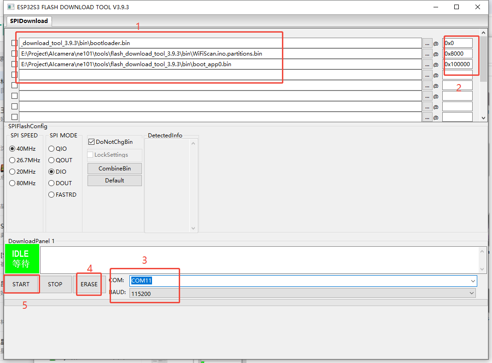
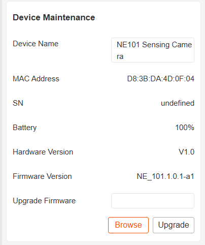

# System Flashing

## 设备烧录

MCU采用的esp32s3，IDF版本使用的5.1.1。

烧录方式可以参考ESP官方提供文档：[ ESP-IDF Programming Guide release-v5.1 documentation](https://docs.espressif.com/projects/esp-idf/en/release-v5.1/esp32s3/get-started/windows-setup.html)

### 使用VSCode插件

VSCode支持代码查看、编译、烧写，开发者建议使用该工具。

环境搭建可以参考：[Development Environment Setup](./Development%20Environment%20Setup)

### 烧写工具

烧录工具获取地址：

具体的烧写步骤如下

- 打开烧写工具
  
  

- 选择文件和flash烧录地址

- 选择相应的COM

- 执行ERASE后执行START，等待烧写成功，系统重启。
  
  

## OTA升级

设备进入配置模式，连接web，在设备维护中选择文件升级。

等待升级成功，wifi自动重连。

查看升级后的版本信息。

