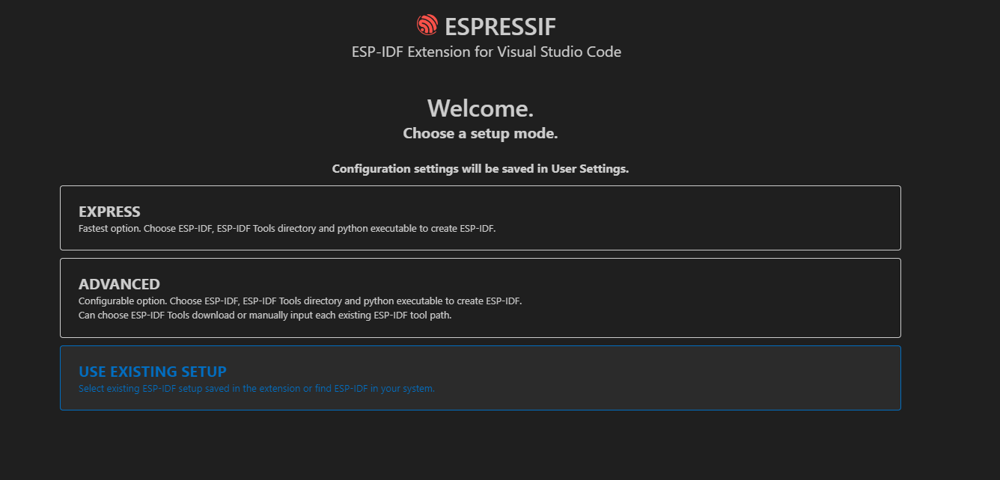

# Development Environment Setup

本文档旨在介绍开发者搭建 ESP32-S3 基于IDF5.1.1开发的软件环境。

ESP官方参考文档:[ESP-IDF Programming Guide release-v5.1 documentation](https://docs.espressif.com/projects/esp-idf/en/release-v5.1/esp32s3/get-started/index.html)

## IDE安装

IDE有以下两种方式：

- [Eclipse Plugin](https://github.com/espressif/idf-eclipse-plugin/blob/master/README.md)

- [VSCode Extension](https://github.com/espressif/vscode-esp-idf-extension/blob/master/docs/tutorial/install.md)

## 命令行编译

参考：[Standard Setup of Toolchain for Windows - ESP32-S3 ](https://docs.espressif.com/projects/esp-idf/en/release-v5.1/esp32s3/get-started/windows-setup.html)

## VSCode Extension

官方参考文档：[ ESP-IDF Extension for VSCode latest documentation](https://docs.espressif.com/projects/vscode-esp-idf-extension/en/latest/installation.html)

### 1、安装VScode后,添加Espressif IDF扩展

### 2、安装ESP-IDF

使用ctrl+shiift+p调出命令行输入Configure ESP-IDF extension即可完成进入ESP-IDD配置界面。

有3种选择可供选择

**EXPRESS**（首选）
官方提示这是最快的选项。选择ESP-IDF版本(5.1.1)和python版本创建ESP-IDF python虚拟环境。ESP-IDF Tools将安装在以下位置：X：\Espressif。

**ADVANCED** 可配置选项。选择ESP-DF版本和python版本以创建ESP-IDF python虚拟环境选择ESP-DF工具安装目录或手动输入每个现有ESP-IDF工具路径。

**USE EXISTING SETUP** 第三个是自动识别路径给出以及安装的环境。

事实上第一种方法是安装取决github下载速度。
第二种方法与第三种方法区别在于第三种是自动识别离线安装的环境，第二种是适合多个idf版本共存时配置的情况

选择**EXPRESS**，指定5.1.1版本，安装。

配置安装完成的标志如下：

### 3、使用VSCode编译烧录

- 打开项目工程

- 配置、编译、烧录
  
  
