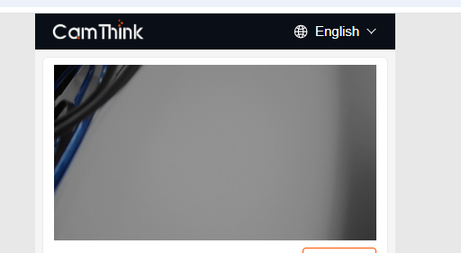
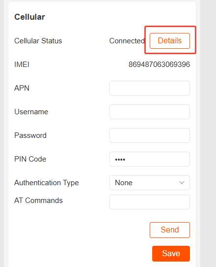
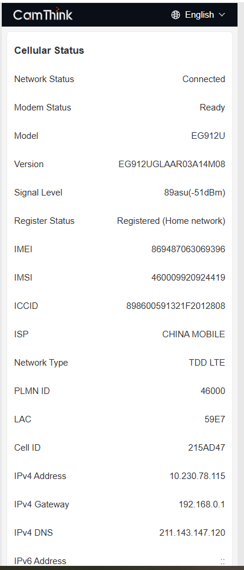
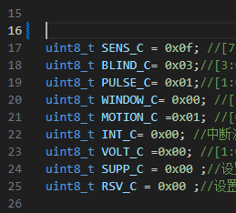

# example

本文档提供以下例子供参考。

- uvc替换camera的功能实现。

- 网络模块更换为蜂窝

- PIR唤醒的实现

代码的获取和编译参考：[Development Environment Setup](./../Software%20Guide/Development%20Environment%20Setup)

## UVC实现

应用场景：可以使用定制的专用摄像头，usb线路简单，便于扩展。

ESP32S3平台支持的USB协议是1.1，如果是自定义的uvc需要支持usb1.1。

### 软件实现

1. 软件中打卡UVC功能。将main/camera.c中CAMERA_USE_UVC设置为1。

2. UVC默认使用最高分辨率。分辨率修改则修改main/uvc.c下的参数，并适当调整buffer大小。
   
   

3. 编译并烧录。

### 测试

1. 连接好设备，等待设备启动并初始化。

2. 按下按键进入配置模式，进入web界面后查看图像是否正常。
   
   
   
   COM上打印可以看到设备的枚举信息。
   
   

3. 设置抓拍，并确认抓图是否正常。
   
   详细步骤可参考：[Quick Start](./../Quick%20Start)

## 网络模块更换为蜂窝

应用场景：适用于户外没有网关和wifi的场景。

### 软件实现

当前软件已经实现网络模块自动识别功能，编译烧录即可。

### 测试

1. 连接好蜂窝模组，插入sim卡，等待设备启动并初始化。

2. 按下按键进入配置模式，进入web界面后查看蜂窝状态。

3. 设置抓拍，并确认抓图是否正常。
   
   详细步骤可参考：[Quick Start](./../Quick%20Start)

## PIR唤醒实现

应用场景：适用于运动物体的实时抓拍。

### 软件实现

1. 软件打开PIR功能。将main/pir.h中PIR_ENABLE设置为1。

2. 将log等级修改为Error。pir配置时对时序有要求，串口打印会影响配置。
   
   

3. 修改pir使用的io。在main/pir.h中。
   
   PIR_INTDOUT_IO必须在RTC IO内才能使用唤醒功能。[GPIO &RTC GPIO - ESP32-S3](https://docs.espressif.com/projects/esp-idf/en/release-v5.1/esp32s3/api-reference/peripherals/gpio.html?highlight=rtc%20io)
   
   PIR_SERIAL_IO外部不能有上拉。
   
   

4. 修改PIR相关的灵敏度，按照需求配置。
   
   

5. 编译烧录。

### 测试

待设备启动配置进入休眠后，触发PIR确认能否唤醒（指示灯会亮）。
