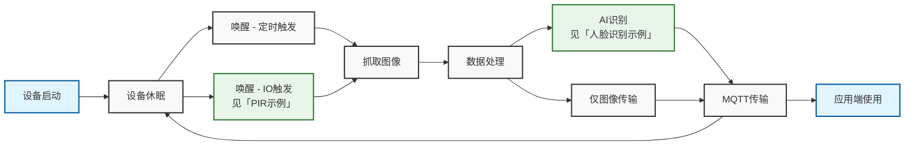

# Low Power Image Acquisition

## 应用简介

本项目基于NE101硬件特性实现低功耗图像采集相机的项目工程实现示例。软件工程上实现了支持低功耗工作模式、通讯管理、MQTT管理、数据传输等应用程序逻辑，适合在图像采集场景下使用。基于此项目工程，开发者可结合传感器采集数据进行采集判断或者结合本地AI算法完成更加丰富的应用拓展。

## 主要特性

- 超低功耗设计，支持电池供电长期工作
- 灵活的唤醒机制，支持定时和传感器触发
- 完整的图像采集和数据传输流程
- 开放的扩展接口，支持AI和传感器功能扩展
  - 传感器扩展参见[「PIR示例」](../3-Software%20Guide/3-example-pir.md)
  - AI扩展参见[「人脸识别示例」](1-human-face-detect.md)

## 程序逻辑



## 软件资源

1. **预编译固件**：
   
   - 示例固件：[lowpower_camera bin](https://github.com/camthink-ai/lowpower_camera/tree/main/bin/NE_101.1.0.1.bin)

2. **源码开发**：
   
   - 最新版 Visual Studio Code（1.99.2以上）
   - ESP-IDF 插件（v5.1.6版本)
   - 示例代码库[lowpower_camera](https://github.com/camthink-ai/lowpower_camera.git)

### 使用预编译固件升级

1. **设备连接**
   
   完整硬件连接指南：[硬件连接说明](.././Hardware%20Guide/Hardware%20Connection)

2. **设备烧录**
   
   烧录方法请参考：[System Flashing](./../Software%20Guide/System%20Flashing%20and%20Initialization)

### 使用源码开发验证

1. **获取源码**
   
   ```bash
   git clone https://github.com/camthink-ai/lowpower_camera.git
   ```

2. **打开工程**
   
   使用 VS Code 打开工程目录
   
   

3. **编译**
   
   

4. **烧录**
   
   

## 软件说明

本章节主要介绍项目工程中的软件功能模块，包括图像调整、拍照设置、数据上报等核心功能。通过这些功能模块的配置和使用，可以实现低功耗图像采集的完整应用流程。

### 软件功能

软件功能包括以下几个主要部分:

- 图像调整：用于控制图像的亮度、对比度、饱和度等参数
- 拍照设置：支持定时拍照、报警触发拍照等多种拍摄模式
- 数据上报：通过MQTT协议将图像数据上传至服务器
- 设备维护：提供设备管理和维护相关的功能

以下将详细说明各个功能模块的具体参数和使用方法。

#### 图像调整（Image Adjustment）

- **补光灯（Supplement Light）**
  - 选项：`Always off`（始终关闭）
- **亮度（Brightness）**
  - 可调节范围：滑块控制（当前值：0）
- **对比度（Contrast）**
  - 可调节范围：滑块控制（当前值：0）
- **饱和度（Saturation）**
  - 可调节范围：滑块控制（当前值：2）
- **水平翻转（Flip Horizontal）**
  - 开关状态：已开启
- **垂直翻转（Flip Vertical）**
  - 开关状态：已开启
- **恢复默认（Default）按钮**
  - 功能：重置图像参数为默认值
    

#### 拍照设置（Capture Setting）

- **启用定时拍照（Enable Scheduled Capture）**
  - 开关状态：已开启
- **拍照模式（Capture Mode）**
  - 当前设置：`Timed Capture`（定时拍照）
- **时间设置（Time Setting）**
  - 拍照时间点：
    - Daily 09:00
    - Daily 10:00
    - Daily 11:00
    - Daily 12:00
- **启用报警输入拍照（Enable Alarm-In Capture）**
  - 开关状态：已关闭
- **启用拍照按钮（Enable Capture Button）**
  - 开关状态：已开启
    

#### 数据上报（Data Report）

- **Host**：`192.168.44.80`
- **MQTT Port**：`1884`
- **Topic**：`left`
- **Client ID**：`HNezYuG6EVzNjJ6PAQZ0`
- **QoS**：`QoS 0`
- **Username / Password**：留空
- **保存按钮（Save）**
  - 保存数据上报相关配置
    

#### 设备维护（Device Maintenance）

- **设备名称（Device Name）**：`NE101 Sensing Camera 01`
- **MAC 地址（MAC Address）**：`D8:3B:DA:4E:10:88`
- **电池（Battery）**：`100%`
- **硬件版本（Hardware Version）**：`V1.0`
- **固件版本（Firmware Version）**：`NE_101.1.0.1`
- **固件升级（Upgrade Firmware）**
  - 通过本地上传固件文件进行升级
    

#### 网络连接（Connection）

- **支持的网络类型**
  - Wi-Fi：支持2.4GHz/5GHz双频段连接
  - WiFi HaLow：支持868MHz/915MHz长距离连接
  - Cat.1：支持全球蜂窝网络连接
- **网络配置功能**
  - Wi-Fi网络列表显示
    - 信号强度指示（RSSI）
    - 加密类型显示（WPA/WPA2/WPA3）
    - 连接状态实时更新
  - WiFi HaLow专属配置
    - 地区选择（欧洲/北美）
    - 频段自动适配
  - Cat.1蜂窝网络设置
    - APN配置
    - SIM卡状态显示
- **网络管理**
  - 一键刷新：快速扫描可用网络
  - 自动重连：网络中断自动恢复


#### 休眠模式（Sleep Mode）

- **Sleep Mode 按钮**
  - 功能：一键将设备切换为低功耗休眠状态

### 软件使用说明

软件的使用说明可以见[快速开始](../1-Quick%20Start.md)

## 应用说明

> NE101作为低功耗图像采集设备的特点是以较强的生命周期来进行图像采集，下方将说明设备采集的数据如何进行应用与使用的简单示例。

### MQTTX接收MQTT数据

为了验证设备的数据上报功能是否正常，可以使用 MQTT 客户端工具（如 [MQTTX](https://mqttx.app/)）进行数据接收测试。

#### 步骤说明

> 需要保证MQTTX服务端与NE101处于同一网络环境

1. 打开 MQTTX，点击 `新建连接`。
2. 设置以下连接参数：
   - **Host**：`192.168.44.80`
   - **Port**：`1884`
   - **Client ID**：任意字符串，例如 `mqttx-client-01`
   - **Topic**：`left`
   - **Username / Password**：留空
3. 点击连接后，订阅 Topic `left`。
4. 设备采集到图像数据后，将通过 MQTT 向该 Topic 发布消息。

#### 数据格式说明

设备发送的 MQTT 消息 payload 内容为 JSON 格式，如下所示：

```json
{
  "ts": 1740640441620,
  "values": {
    "devName": "NE101 Sensing Camera",
    "devMac": "D8:3B:DA:4D:10:2C",
    "battery": 84,
    "snapType": "Button",
    "localtime": "2025-02-27 15:14:01",
    "imageSize": 74371,
    "image": "data:image/jpeg;base64,..."
  }
}
```

#### 字段说明

- `ts`：时间戳（毫秒）
- `devName`：设备名称
- `devMac`：设备 MAC 地址
- `battery`：电池电量（百分比）
- `snapType`：图像采集类型（如 `Button`, `Scheduled`, `PIR` 等）
- `localtime`：本地时间（字符串格式）
- `imageSize`：图像大小（单位：字节）
- `image`：Base64 编码的 JPEG 图像数据，前缀为 `data:image/jpeg;base64,`

#### 可视化建议

使用 Base64 图像数据可在网页或工具中快速预览图像：

```html

```

也可以将 Base64 数据粘贴至 [Base64图像查看器](https://base64.guru/converter/decode/image) 进行在线预览。
