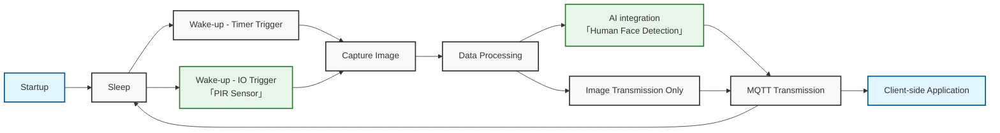

import useBaseUrl from '@docusaurus/useBaseUrl';

# Low-Power Image Acquisition

## Overview

This project provides a sample implementation of a low-power image capture system based on the NE101 hardware platform. It integrates application-level features such as low-power mode support, communication and MQTT management, and data transmission, making it well-suited for image acquisition scenarios. Developers can further extend the project by incorporating sensor-based data evaluation or local AI algorithms to enable more advanced and customized applications.

## Key Features

- Ultra-low power，suitable for long-term battery-powered operation
- Flexible wake-up mechanisms，including timer-based and sensor-triggered wake-up
- Complete image acquisition and data transmission workflow
- Open expansion interfaces for AI and sensor module integration
  - Sensor integration example[「PIR Sensor」](../NE100-MB01%20Development%20Board/Software%20Guide/example-pir)
  - AI integration example:[「Human Face Detection」](./human-face-detect)

## Program Logic



## Software Resources

1. **Firmware**：
   
   - Download pre-compiled firmware for use：[lowpower_camera.zip](https://github.com/camthink-ai/lowpower_camera/tree/main/bin/NE_101_FCC.zip)

2. **Development Environment**：
   
   - Latest version of Visual Studio Code (v1.99.2 or later)
   - ESP-IDF extension (v5.1.6)
   - Example project repository [lowpower_camera](https://github.com/camthink-ai/lowpower_camera.git)

### Pre-compiled Firmware

1. **Using Precompiled Firmware**
   
   For More details please refer to [the Hardware Connection Guide](./../NE100-MB01%20Development%20Board/Hardware%20Guide/Hardware%20Connection)

2. **Firmware flashing**
   
   Refer to the below to flash the firmware：[System Flashing](./../NE100-MB01%20Development%20Board/Software%20Guide/System%20Flashing%20and%20Initialization)

### Using Source Code Development

1. **Clone the repository using the following command**
   
   ```bash
   git clone https://github.com/camthink-ai/lowpower_camera.git
   ```

2. **Project setup**
   
   Open the directory in VS Code：
   
   

3. **Select the build button to compile the source code**
   
   

4. **Select the flash button to upload the generated firmware to the device**
   
   

## Software Description

This section introduces the core functional modules included in the project, including image adjustment, capture settings, data reporting, and other core functions. By configuring and utilizing these modules, developers can implement a complete low-power image acquisition workflow tailored to various application scenarios.

### Functions

The software includes the following key functional modules:

- Image Adjustment：Used to control image parameters such as brightness, contrast, and saturation.
- capture Settings：Supports multiple capture modes including scheduled shooting and event-triggered shooting (e.g., alarm input).
- Data Reporting：Uploads image data to the server via the MQTT protocol.
- Device Maintenance：Provides management and maintenance functionalities for the device.

The following sections will detail the usage for each function.

#### Image Adjustment

- **Supplement Light**
  - Option：`Always off`
- **Brightness**
  - Adjustable via slider (Current value: 0)
- **Contrast**
  - Adjustable via slider (Current value: 0)
- **Saturation**
  - Adjustable via slider (Current value: 2)
- **Flip Horizontal**
  - Toggle: Enabled
- **Flip Vertical**
  - Toggle: Enabled
- **Reset to Default**
  - Reset image parameters to default values
    

#### Capture Setting

- **Enable Scheduled Capture**
  - Toggle: Enabled
- **Capture Mode**
  - Current setting：`Timed Capture`
- **Time Setting**
  - Capture times：
    - Daily 09:00
    - Daily 10:00
    - Daily 11:00
    - Daily 12:00
- **Enable Alarm-In Capture**
  - Toggle:Disabled
- **Enable Capture Button**
  - Toggle: Enabled
    

#### Data Report

- **Host**：`192.168.44.80`
- **MQTT Port**：`1884`
- **Topic**：`left`
- **Client ID**：`HNezYuG6EVzNjJ6PAQZ0`
- **QoS**：`QoS 0`
- **Username / Password**：Empty
- **Save**
  - Save and upload the related configuration settings.
    

#### Device Maintenance

- **Device Name**：`NE101 Sensing Camera 01`
- **MAC Address**：`D8:3B:DA:4E:10:88`
- **Battery**：`100%`
- **Hardware Version**：`V1.0`
- **Firmware Version**：`NE_101.1.0.1`
- **Upgrade Firmware**
  - Upgrade by uploading the firmware file locally.
    

#### Connection

- **Supported Network Types**
  - Wi-Fi：Supports dual-band 2.4GHz/5GHz connections
  - WiFi HaLow：Supports long-range connectivity at 868MHz/915MHz
  - Cat.1：Supports global cellular network 
- **Network Configuration**
  - Wi-Fi
    - Received Signal strength indicator （RSSI）
    - Wi-Fi security protocols（WPA/WPA2/WPA3）
    - Real-time connection status updates
  - WiFi HaLow
    - Region selection (Europe / North America)
    - Automatic frequency band adaptation
  - Cat.1 Cellular Network
    - APN
    - SIM card status display
- **Network Management**
  - One-click Refresh：Quickly scan for available networks
  - Auto Reconnect：Automatically restore connection after network interruption


#### Sleep Mode

- **Sleep Mode Button**
  - Function: Instantly switches the device into low-power sleep mode

### Software Usage

For basic setup and usage instructions, please refer to [the Quick Start Guide.](../1-Quick%20Start.md)

## Description

> The NE101 is a low-power image capture AI Camera designed for long-term, continuous operation. The following section provides a basic example of how to apply and utilize the captured image data.

### Receiving MQTT Data via MQTTX

To verify that the device is correctly reporting data, you can use an MQTT client tool such as [MQTTX](https://mqttx.app/)）to receive and view MQTT messages.

#### Step-by-Step

> Ensure that both the MQTTX client and the NE101 device are on the same network.

1. Open MQTTX and click`New Connection`。
2. Configure the following parameters：
   - **Host**：`192.168.44.80`
   - **Port**：`1884`
   - **Client ID**：any string, e.g., `mqttx-client-01`
   - **Topic**：`left`
   - **Username / Password**：Empty
3. Click Connect, then subscribe to topic `left`
4. Once the NE101 captures an image, it will publish data to this topic via MQTT.

#### Message Payload Format

The payload of the MQTT message is in JSON format, as shown below:

```json
{
  "ts": 1740640441620,
  "values": {
    "devName": "NE101 Sensing Camera",
    "devMac": "D8:3B:DA:4D:10:2C",
    "battery": 84,
    "snapType": "Button",
    "localtime": "2025-02-27 15:14:01",
    "imageSize": 74371,
    "image": "data:image/jpeg;base64,..."
  }
}
```

#### Field Descriptions

- `ts`：Timestamp in milliseconds
- `devName`：Device name
- `devMac`：Device MAC address
- `battery`：Battery level (%)
- `snapType`：Capture type (e.g., `Button`, `Scheduled`, `PIR` ）
- `localtime`：Local time in string format
- `imageSize`：Image size in bytes
- `image`：Base64-encoded JPEG image data (prefixed with `data:image/jpeg;base64,`

#### Visualization Tip

You can quickly preview the Base64 image in a web browser using:

```html

```

Or paste the Base64 string into an online [Base64 Image Viewer](https://base64.guru/converter/decode/image)  for instant preview.
